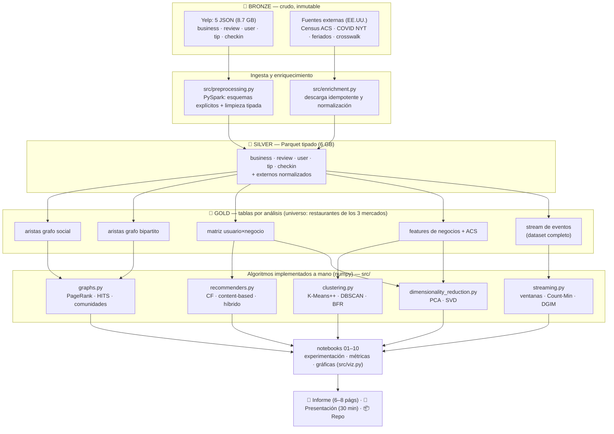
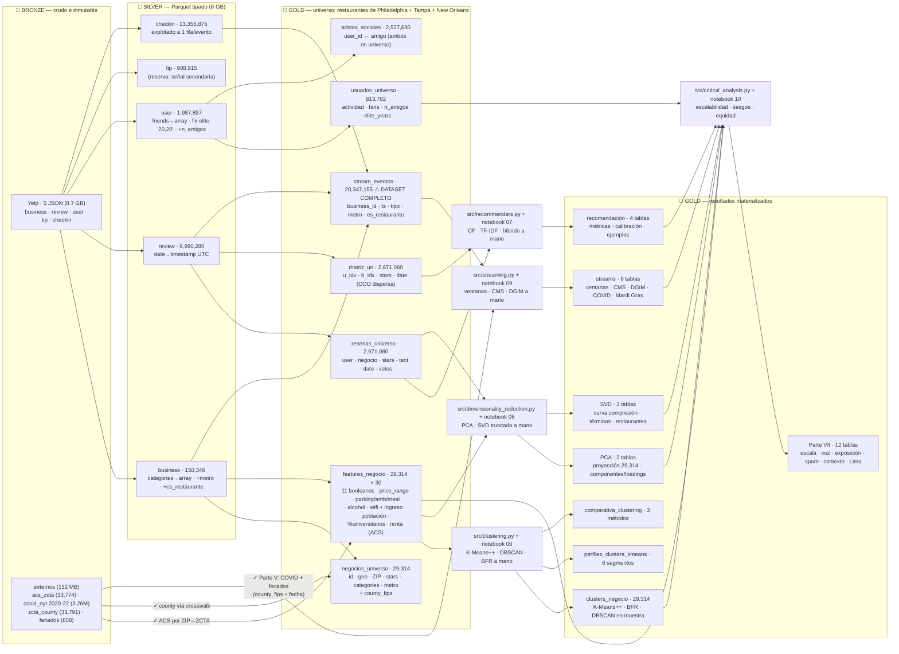

# Minería de Datos Masivos sobre Yelp: Influencia, Comunidades y Recomendación en el Ecosistema de Restaurantes

Proyecto 2 del curso de Data Mining (UTEC, 2026-1) — Prof. Heider Sanchez.

**Repositorio público:** [Joharjbe/proyecto-2-data-mining-yelp](https://github.com/Joharjbe/proyecto-2-data-mining-yelp)

> **El proyecto en un párrafo.** Sobre el Yelp Open Dataset (6.99M reseñas, 150k negocios,
> 1.99M usuarios) construimos un pipeline integral de minería de datos masivos que responde una
> pregunta central: **¿quién influye, cómo se agrupan y qué recomendarle a quién en el ecosistema
> de restaurantes?** Los algoritmos se implementan **a mano** (numpy puro) al cerrar cada parte;
> Spark, Parquet y la arquitectura medallón se reservan para ingeniería de datos. Están completas
> las **siete partes**: PageRank, HITS, comunidades, K-Means++, DBSCAN, BFR, recomendación
> híbrida, streams, PCA/SVD y análisis crítico de escalabilidad/sesgos/equidad. El estudio se
> enriquece con cuatro fuentes públicas externas (Census ACS, COVID-19 del NYT, feriados y
> crosswalk geográfico) y cierra con un análisis crítico de escalabilidad, sesgos y equidad.

La cobertura exacta de cada criterio y su evidencia está en la
[matriz de trazabilidad de la rúbrica](docs/RUBRICA.md).

---

## Índice

1. [Objetivo y preguntas](#1-objetivo-y-preguntas)
2. [Los datos](#2-los-datos)
3. [Diseño del estudio](#3-diseño-del-estudio-alcance-y-justificación-metodológica)
4. [Arquitectura del pipeline](#4-arquitectura-del-pipeline)
5. [Diagrama de datos (linaje)](#5-diagrama-de-datos-linaje-de-tablas)
6. [Fuentes externas y qué aporta cada una](#6-fuentes-externas-y-qué-aporta-cada-una)
7. [Recorrido por notebooks: qué hicimos y qué encontramos](#7-recorrido-por-notebooks-qué-hicimos-y-qué-encontramos)
8. [Hallazgos principales hasta ahora](#8-hallazgos-principales-hasta-ahora)
9. [Estructura del repositorio](#9-estructura-del-repositorio)
10. [Instalación y reproducción](#10-instalación-y-reproducción)
11. [Estado / avances](#11-estado--avances)
12. [Referencias](#12-referencias)

---

## 1. Objetivo y preguntas

Desarrollar un proyecto integral de minería de datos masivos aplicando las técnicas del curso
sobre un dataset real, con tres preguntas guía que conectan las siete partes del enunciado:

1. **Influencia** (Parte II): ¿quiénes son los usuarios y restaurantes que estructuran la red?
   ¿Coincide la influencia estructural (PageRank/HITS) con las señales visibles (fans, Elite)?
2. **Segmentación** (Partes III y VI): ¿en qué grupos naturales se organizan los restaurantes
   según sus atributos y su contexto socioeconómico, y qué patrones latentes revela la
   descomposición de la matriz usuario×negocio?
3. **Recomendación y su contexto** (Partes IV, V y VII): ¿qué tan bien podemos recomendar
   restaurantes combinando comportamiento y contenido, cómo late la actividad en el tiempo
   (pandemia y feriados incluidos), y qué sesgos y problemas de equidad arrastra todo lo anterior?

La regla del curso que gobierna el código: **las técnicas se implementan sin librerías externas**
— el código debe reflejar los algoritmos estudiados. Las librerías (numpy, pandas, Spark) se
limitan a manipulación de datos y gráficas.

## 2. Los datos

**Fuente principal: [Yelp Open Dataset](https://business.yelp.com/data/resources/open-dataset/)**
(licencia académica; los datos no se redistribuyen en este repo). Un TAR de 4.35 GB que
descomprime a 8.65 GB con 5 archivos JSON (un objeto por línea):

| Archivo | Filas (verificadas) | Qué contiene |
|---|---|---|
| `business.json` | 150,346 | negocios: geo, categorías (multi-etiqueta), 39 atributos, rating |
| `review.json` | 6,990,280 | reseñas completas con texto, estrellas, votos y timestamp (2005 → 19-ene-2022) |
| `user.json` | 1,987,897 | usuarios: actividad, **lista de amigos** (grafo social), años Elite |
| `checkin.json` | 13,356,875 eventos | visitas físicas con timestamp puro |
| `tip.json` | 908,915 | recomendaciones cortas (función en declive; señal secundaria) |

El dataset cubre **11 áreas metropolitanas** ("metros": ciudad + suburbios) de EE.UU. y Canadá —
no es un censo nacional sino una colección de mercados aislados, y esa estructura define el
diseño del estudio (sección 3).

**Fuentes complementarias** (132 MB en total; detalle en sección 6): Census ACS 5-year
(demografía por ZIP), COVID-19 del New York Times (county+día; licencia CC BY-NC, datos
atribuidos a *The New York Times*), calendario de feriados US/PA/FL/LA (incluye Mardi Gras) y
crosswalk ZCTA↔county del Census. El API del Census exige una key gratuita
([registro](https://api.census.gov/data/key_signup.html)) guardada en `codigo/.census_key`.

## 3. Diseño del estudio: alcance y justificación metodológica

Esta es la sección más importante del proyecto, porque toda decisión posterior depende de ella.
La resumimos primero en una frase y luego la justificamos paso a paso:

> **Universo de análisis: los restaurantes de tres mercados completos — Philadelphia, Tampa y
> New Orleans — para los algoritmos intensivos; el dataset completo para el EDA y la minería de
> flujos.** No es una simplificación por comodidad: es un diseño muestral deliberado, tomado con
> evidencia y con la teoría del curso como guía.

### 3.1 El problema: hay algoritmos que no escalan, y el curso lo advierte

El enunciado exige técnicas cuyo costo crece mucho más rápido que los datos. Pongámosle números
de *nuestro* dataset para que se vea el tamaño real del problema:

| Técnica (Parte) | Complejidad | ¿Qué significaría sobre el dataset completo? |
|---|---|---|
| DBSCAN sin índice espacial (III) | O(n²) | comparar 150,346 negocios todos contra todos = 2.3×10¹⁰ distancias; la matriz de distancias en float32 ocuparía **~90 GB de RAM** (una laptop tiene 16–32) |
| CURE / jerárquico aglomerativo (III) | ~O(n² log n) | mismo muro de memoria, más el costo de mantener la jerarquía |
| Girvan-Newman (II) | O(m²n) | con el grafo social completo (52.6M aristas, 2M nodos) el conteo de operaciones da ~10²⁰ — **siglos de cómputo**. Como se vio en clase (semana 12 — Detección de Comunidades), su costo computacional es exactamente la limitación que motiva alternativas como la modularidad |

La conclusión no es "usemos menos datos porque es difícil", sino la que enseña el curso: **cada
algoritmo tiene una escala donde se aplica correctamente**. Para estudiar estas técnicas *de
verdad* — converger, calibrar parámetros, comparar resultados — hay que dárselas a un universo
donde corran sin degradarse. La alternativa (mutilar los algoritmos o submuestrear al azar) sí
sería metodológicamente incorrecta, como explica el punto siguiente.

### 3.2 El método: muestrear por mercado, no por reseña (key-based sampling, semana 06)

Como se vio en clase (semana 06 — Minería de Data Streams), muestrear eventos *al azar* destruye
las relaciones entre eventos de una misma entidad. El ejemplo de la diapositiva es exacto a
nuestro caso: si quieres estimar consultas duplicadas y muestreas el 10% de los eventos, la
probabilidad de capturar *ambas* ocurrencias de un duplicado es 1/100, no 1/10 — el estimador se
rompe. La solución de clase es el **muestreo por clave (key-based sampling)**: se elige una clave
que agrupa los eventos relacionados y *toda* la clave entra o sale junta.

Aplicado aquí: si tomáramos un 20% de reseñas al azar, el grafo social quedaría hecho trizas
(amistades con un solo extremo), la matriz usuario×negocio perdería las co-ocurrencias que el
filtrado colaborativo necesita (semana 10 — dos usuarios "parecidos" dejarían de compartir
restaurantes en la muestra), y las métricas de evaluación quedarían sesgadas. En cambio, nuestra
clave de muestreo es el **mercado completo** (el área metropolitana, unidad natural del propio
dataset): dentro de cada mercado elegido conservamos el 100% de los negocios, el 100% de sus
reseñas, el 100% de los usuarios que las escribieron y el 100% de las amistades entre ellos.
Los grafos y matrices internos quedan **íntegros**, no muestreados.

### 3.3 La evidencia: por qué exactamente estos tres mercados (notebook 02)

La elección se hizo con la tabla de conteos reales del notebook 02, bajo tres criterios:

1. **Masa de datos.** Philadelphia, Tampa y New Orleans son el top-3 en reseñas de restaurantes:
   2,671,060 reseñas = **56.5% de las 4.72M** que tiene todo el dataset. Con 3 de 11 mercados
   cubrimos más de la mitad del fenómeno.
2. **Diversidad de arquetipos.** No queríamos tres ciudades parecidas, porque los hallazgos
   quedarían atados a un solo tipo de mercado. La intensidad (reseñas por restaurante) los
   distingue sola: **Philadelphia (78)** = mercado residencial maduro del noreste, con larga cola
   de locales de barrio; **Tampa (91)** = mercado sunbelt en crecimiento; **New Orleans (153)** =
   capital turístico-gastronómica, pocos locales hiperreseñados y estacionalidad por eventos
   (Mardi Gras). El EDA del ACS (notebook 04) confirmó el contraste también en lo socioeconómico.
3. **Cobertura de fuentes externas.** Los tres son de EE.UU.: cruce directo con Census ACS y
   COVID-19. Edmonton (Canadá) — además el mercado más pequeño, con 68.9k reseñas — quedaba fuera
   de ambas fuentes; doble razón para excluirlo del núcleo.

### 3.4 Lo que NO se recorta: el dataset completo sigue en juego

Aquí está la otra mitad del diseño, igual de importante. Las técnicas de la Parte V — ventanas
deslizantes, Count-Min Sketch, y compañía — son, como se vio en clase (semana 06), algoritmos de
**una sola pasada con memoria sublineal**: existen precisamente para cuando los datos son
demasiado grandes o rápidos para almacenarlos y consultarlos exactos. Degradarlas a un subconjunto
sería desperdiciar su razón de ser. Por eso:

- el **EDA (Parte I)** se ejecutó sobre el dataset íntegro (6.99M reseñas, 13.36M check-ins,
  1.99M usuarios) — ninguna fila se filtró antes de explorarla;
- el **stream de la Parte V** conserva los **20.35M de eventos** de los 11 mercados.

El proyecto queda así montado sobre el contraste que define al big data: **análisis exacto donde
la escala lo permite, análisis aproximado con garantías donde no** — y podremos medir ambos
regímenes con tiempos y errores reales (insumo directo de la Parte VII, escalabilidad).

### 3.5 Orden metodológico: el EDA precede a toda decisión de recorte

Para que la decisión sea auditable, el orden de los notebooks ES el orden de las decisiones:

| Paso | Notebook | Qué se decidió ahí |
|---|---|---|
| 1. Perfilado | 02 | integridad verificada + tabla comparativa de los 11 mercados → **hipótesis** de universo |
| 2. Exploración total | 03 | EDA de todas las variables **sin ningún filtro**, sobre el dataset íntegro → conocimiento para validar o tumbar la hipótesis |
| 3. Materialización | 04 | **análisis de sensibilidad** del filtro y del recorte, con números → recién aquí se construyen las tablas gold |

Ninguna fila se descartó sin haberla explorado primero. Y el alcance sigue siendo una **hipótesis
de trabajo**: al llegar a cada técnica re-validamos tamaños y tiempos reales y, si hace falta,
ajustamos con evidencia (p. ej., aplicar Girvan-Newman sobre una comunidad o la componente
gigante, como hace la propia literatura — y como permite el enunciado al ofrecer Louvain como
alternativa).

### 3.6 La definición operativa de "restaurante" (y su prueba de sensibilidad)

Universo = negocios cuya lista `categories` contiene exactamente el token **`Restaurants`** — la
categoría raíz de la taxonomía de Yelp para locales que sirven comida preparada. Tres virtudes:
es **canónica** (la define Yelp, no nosotros), **reproducible en una línea** y **auditable**.
Como las categorías son multi-etiqueta (~4 por negocio), un café o panadería genuinamente
gastronómico porta también `Restaurants`: el filtro no lo pierde.

¿Y si hubiéramos ampliado a `Restaurants ∪ Food`? El notebook 04 lo midió en vez de suponerlo:
se sumarían 6,746 negocios pero solo +7.8% de reseñas, porque el bloque `Food sin Restaurants`
promedia **30.8 reseñas por local contra 91.1** de los restaurantes, y sus categorías top son
Shopping, Grocery, Convenience Stores y Drugstores — **retail de alimentos, no competencia
gastronómica**. Mezclarlos contaminaría los clusters (Parte III) y las recomendaciones (Parte IV)
con entidades que no compiten entre sí. Decisión cerrada con tabla, no con fe.

## 4. Arquitectura del pipeline

Usamos la arquitectura **medallón**, un patrón estándar de ingeniería de datos con tres capas que
se leen como una refinería:

- 🥉 **Bronze** — los datos *crudos, tal cual llegaron*, intocables. Si algo sale mal aguas
  abajo, siempre se puede reconstruir todo desde aquí. (Los 5 JSON de Yelp + los CSV externos.)
- 🥈 **Silver** — los mismos datos pero *limpios y tipados*: fechas convertidas a timestamp,
  strings a arrays, bugs corregidos, todo en Parquet. Cada transformación de bronze→silver está
  documentada con su porqué — esto es literalmente la "limpieza justificada" que pide la rúbrica,
  convertida en arquitectura.
- 🥇 **Gold** — tablas *listas para cada análisis*, con solo las columnas que ese análisis usa:
  las aristas del grafo, la matriz de ratings, las features de clustering. Ningún algoritmo lee
  JSON ni silver: siempre gold. Eso hace cada experimento rápido y reproducible.

Los notebooks orquestan, experimentan y validan; los módulos de `src/` contienen la lógica
reutilizable; los algoritmos del curso van a mano sobre numpy y consumen exclusivamente gold.

**Por qué Spark + Parquet (con nuestros números, no de catálogo):** convertir los 8.7 GB de JSON
a Parquet tipado tomó **64 segundos** en un M1 Pro con Spark local (los 10 cores en paralelo) y
dejó 6 GB columnares. La compresión es selectiva — `business` cayó 114→21 MB (−82%) pero `review`
apenas (el texto libre no comprime) — y esa observación dictó una regla de diseño: las tablas gold
llevan **solo las columnas que cada análisis usa**, porque Parquet lee por columna. Spark queda
además como argumento empírico de escalabilidad para la Parte VII. Configuración relevante:
`local[*]`, driver 8 GB, `shuffle.partitions=16`, sesión en UTC, semilla global 42.



Decisiones de diseño que el diagrama refleja: (1) las fuentes externas entran por su propio módulo
y se integran ya en silver/gold, de modo que *gold* nace enriquecido; (2) el stream de eventos
(Parte V) es la única tabla gold construida sobre el **dataset completo**, coherente con el diseño
del estudio; (3) ningún algoritmo lee JSON ni silver directamente: siempre gold, lo que hace cada
experimento reproducible y rápido. (Versión editable del diagrama: `docs/arquitectura.excalidraw`.)

## 5. Diagrama de datos: linaje de tablas

Qué tabla nace de cuál, con sus filas y columnas clave. Las flechas continuas son cruces ya
materializados (✓); las punteadas, cruces que se ejecutan en su parte correspondiente.
*Este diagrama se actualiza en cada hito.* — **Última actualización: 18-jun-2026, Partes I–VII completas.**



Consumo por parte del proyecto: **II** grafos ← g4, g5 (+g3 para interpretar) · **III** clustering
← g6 · **IV** recomendación ← g5, g2 (texto) · **V** streams ← g7 (+COVID/feriados) ·
**VI** PCA/SVD ← g6, g2 (TF-IDF) · **VII** ética/escalabilidad ← resultados y riesgos de I–VI.

**Salidas de la Parte II (nuevas tablas gold + figuras):** `ranking_usuarios` (PageRank social + HITS hub por usuario), `ranking_negocios` (PageRank bipartito + HITS authority por negocio) y `comunidades_coresena_philadelphia` (restaurante → comunidad); figuras del informe en `docs/figs/parte2_*` (popularidad vs autoridad, usuarios influyentes, micro-mercados y la **red de co-reseña** nodos/aristas coloreada por comunidad y dimensionada por PageRank).

**Salidas de la Parte III:** `clusters_negocio` (etiquetas y segmento interpretable por restaurante), `perfiles_clusters_kmeans` (6 perfiles) y `comparativa_clustering` (métricas de K-Means++, DBSCAN y BFR). Las 8 figuras `docs/figs/parte3_*` cubren selección de parámetros, perfiles, silueta individual, mezcla de mercados, progreso BFR, proyección PCA común y comparación final.

**Salidas de la Parte IV:** `metricas_recomendacion` (P@K/R@K/NDCG/RMSE/MAE + cobertura/novedad), `curva_hibrido_validacion` (selección de α sin mirar test), `comparativa_score_cf_validacion` (rating predicho vs suma de similitudes) y `recomendaciones_ejemplo` (top-5 explicable por usuario); 6 figuras `docs/figs/parte4_*` (comparativa con IC, frontera precisión-diversidad, curva del híbrido, diseño temporal/cohortes, ajuste del score y **mapa explicativo de una recomendación**).

**Salidas de la Parte V:** `ventanas_stream`, `metricas_cms`, `frecuencias_cms_top`, `evaluacion_dgim`, `actividad_covid_semanal` e `impacto_mardi_gras`. Las 6 figuras `docs/figs/parte5_*` cubren respuesta de ventanas, error/memoria y heavy hitters de CMS, aproximación DGIM, impacto COVID y el experimento natural de Mardi Gras.

**Salidas de la Parte VI:** `proyeccion_pca_restaurantes` y `componentes_pca`; `curva_svd_compresion`, `factores_svd_terminos` y `factores_svd_restaurantes`. Las 6 figuras `docs/figs/parte6_*` cubren varianza/90%, loadings, mapas 2D/3D, error-compresión y vocabularios latentes.

**Salidas de la Parte VII:** 12 tablas `data/gold/` para benchmark/complejidad/memoria, concentración de voz, exposición de rankings y recomendación, stress de spam, contexto de clusters, riesgos y transferibilidad; 6 figuras `docs/figs/parte7_*`. Las auditorías distinguen explícitamente evidencia, proxies y límites causales.

## 6. Fuentes externas y qué aporta cada una

Regla que nos impusimos: **ninguna fuente se integra sin su propio EDA** (cobertura sobre nuestros
ZIPs/counties/fechas, calidad de columnas, y un aporte concreto a alguna parte del proyecto).
Resultado del examen (notebook 04):

| Fuente | Qué trae | Veredicto del EDA | Aporta a |
|---|---|---|---|
| **Census ACS 5-year 2022** (api.census.gov) | mediana de ingreso, población, % universitarios y renta por ZCTA (33,774) | cobertura 83% (Philadelphia), 72% (Tampa), 61% (New Orleans) de nuestros ZIPs — los faltantes son ZIPs no residenciales; ingreso 9.3% nulos, renta 22.6% (se usa con cautela) | features de clustering (III), equidad: ¿los clusters "premium" viven solo en ZIPs ricos? (VII) |
| **COVID-19 NYT** (county+día, 3.26M filas) | casos/muertes acumulados; derivamos casos nuevos 7d | las 3 olas visibles en nuestros mercados; **ómicron muere exactamente en el corte del dataset** (19-ene-2022): hay reseñas durante la ola más alta | contexto exógeno de la Parte V: separar "el restaurante cayó" de "la ciudad estaba cerrada" |
| **Feriados US/PA/FL/LA** (generados con `holidays`) | 858 fechas 2005–2022 | **18 Mardi Gras** año por año — el evento que mueve New Orleans | experimento natural de estacionalidad (V): si las ventanas no lo detectan, algo está mal |
| **Crosswalk ZCTA↔county** (Census 2020) | puente ZIP → county (33,791) | solo 158 de nuestros ZIPs sin mapeo (los mismos no residenciales) | habilita el cruce COVID; `county_fips` ya vive en `negocios_universo` |

*Nota técnica sobre el cruce geográfico:* el `postal_code` de Yelp es un ZIP postal y el ACS
tabula por ZCTA (la aproximación censal del ZIP); en la gran mayoría de casos coinciden, y los
que no, son ZIPs sin población (apartados postales). Usamos la equivalencia directa ZIP↔ZCTA y
documentamos la aproximación — práctica estándar en la literatura aplicada.

Cruces **estructurales** (ACS, county) ya materializados en gold ✓. Cruces **temporales** (COVID,
feriados) se ejecutan en la Parte V contra el stream — pegarlos ahora a 20.3M de filas inflaría la
tabla sin necesidad: el contexto se consulta por ventana, no por evento.

Fuentes evaluadas y descartadas con razón: Yelp Fusion API y SafeGraph (términos/costo), OSM y
portales municipales (esfuerzo geoespacial vs plazo), Google Trends (términos/ruido), datos de
Perú (sin clave de cruce con Yelp — se retoma como discusión de transferibilidad en la Parte VII).
En espera si el cronograma lo permite: NOAA clima, Zillow, USDA, CDC PLACES.

## 7. Recorrido por notebooks: qué hicimos y qué encontramos

*Esta sección crece con el proyecto; cada notebook lleva además su análisis bajo cada salida y un
resumen al cierre.*

### Notebook 01 — Smoke test del entorno
**Qué hace:** valida versiones (Python 3.11, PySpark 3.5.8, Java 17), levanta Spark local y lee
`business.json` completo. **Resultado:** 150,346 negocios contados — entorno reproducible
verificado de punta a punta.

### Notebook 02 — Ingesta bronze → silver y perfilado
**Qué hace:** convierte los 5 JSON (8.7 GB) a Parquet tipado con **esquemas explícitos** (evita
que Spark lea 5 GB dos veces para inferir tipos) y limpiezas documentadas: fechas→UTC,
`friends`→array, corrección del bug histórico `"20,20"`≡2020 en Elite, check-ins explotados a
1 fila/evento, `categories`→array, columnas derivadas `metro` y `es_restaurante`. Verifica
integridad y compara los 11 mercados.
**Resultados clave:** ingesta completa en **64 s**; conteos idénticos a los oficiales; **0
duplicados y 0 reseñas huérfanas** (identidades curadas de origen); rango temporal 16-feb-2005 →
19-ene-2022 — el "desplome" de 2022 en cualquier serie anual es **artefacto de corte** (19 días),
mientras el valle real es 2020: −39% vs 2019. **Decisión tomada aquí:** los 3 mercados del
universo, elegidos con tabla (top-3 = 56.5% de reseñas de restaurantes; arquetipos 78/91/153
reseñas por local; Edmonton descartado por tamaño y por quedar fuera de ACS/COVID).

### Notebook 03 — EDA global (todas las variables, dataset íntegro, sin filtros)
**Qué hace:** diccionario de variables de las 5 tablas (tipo, % nulos, cardinalidad — con conteo
aproximado HyperLogLog ±2%, los duplicados exactos ya estaban verificados); perfilado de negocios,
usuarios, reseñas, check-ins y tips; calidad de datos con decisiones de tratamiento.
**Hallazgos clave:**
- **El dataset son 11 islas urbanas**, no un país (mapa lat/lon): la unidad natural de análisis
  es el mercado — respalda el diseño del estudio.
- **Colas largas en todo**: mediana de 15 reseñas por negocio (p99 = 473); 44% de usuarios sin
  amigos; **el 1% más activo escribe el 24% de las reseñas y el top 10% el 56%** (Gini 0.61).
  El conteo bruto no mide influencia → motiva PageRank/HITS (Parte II).
- **`Restaurants` es la categoría #1** (52,268 negocios, 35%); las categorías son multi-etiqueta
  (~4 por negocio) → el filtro por categoría exacta es seguro.
- **Grafo social global**: 52.6M de amistades, grado medio 53, densidad 2.7×10⁻⁵ — red gigante y
  dispersa: obliga a representaciones por listas (no matrices densas).
- **Sesgos a modelar, no a borrar**: 67% de reseñas son 4–5★ (forma en J — opina quien vivió algo
  extremo); las reseñas de 1★ traen ~60% más texto que las de 5★ (TF-IDF "entenderá" mejor los
  disgustos); solo 4.6% de usuarios fue Elite (etiqueta débil de influencia para validar rankings).
- **Tres relojes temporales** (pico anual en julio; el domingo se escribe más; pico diario en la
  tarde local) + heatmap de 13.4M check-ins ardiendo en cenas y fines de semana → parámetros de
  ventana de la Parte V validados (1h/4h/1día).
- **Calidad**: 0 coordenadas/textos/fechas/estrellas inválidos; suciedad real localizada en los
  **atributos** (solo 1 de 39 supera 60% de llenado; strings crudos de Python 2) y 103 negocios
  sin categorías (0.07%) — plan de tratamiento definido y justificado.

### Notebook 04 — Fuentes externas, universo y tablas gold
**Qué hace:** descarga idempotente de externos + EDA propio de cada fuente (sección 6); análisis
de sensibilidad del filtro; parseo de atributos (`ast.literal_eval` para booleanos, strings
`u'...'` y diccionarios-en-texto; umbral de cobertura ≥30% para no imputar de más); construcción
de las 7 tablas gold; medición del grafo usuario-negocio con BFS propio sobre CSR (numpy).
**Resultados clave:**
- **Sensibilidad que blinda el universo**: `Restaurants` = 29,314 negocios / 2,671,060 reseñas
  (91.1 por local). El bloque `Food sin Restaurants` (6,746) promedia 30.8 y sus categorías top
  son Shopping/Grocery/Convenience/Drugstores — retail, no competencia gastronómica.
- **De 39 atributos sucios a 30 features confiables**: 19 superan el umbral (TakeOut y tarjetas
  91%, delivery y parking 86% — en el universo de restaurantes la cobertura mejora mucho vs el
  dataset completo), expandidos a 11 booleanos + precio (1–4) + flags + 4 indicadores ACS.
- **Gold materializado (1.4 GB)**: universo analítico en cientos de miles de filas + stream
  completo de **20,347,155 eventos** — los dos regímenes del proyecto, en disco.
- **Hallazgo de integridad fina**: 4 reseñadores "fantasma" (reseñas cuyo autor no existe en
  `user.json`; cuentas borradas) — inofensivo y documentado: en datos reales la integridad nunca
  es perfecta en todas las direcciones.
- **El grafo usuario-restaurante medido** (lo que pide la Parte I): densidad bipartita
  **1.12×10⁻⁴** (solo 0.011% de la matriz llena — el desierto que el filtrado colaborativo
  cultivará), grados medios 3.3 (usuario) vs 91.1 (restaurante), componente gigante del **100.0%**
  (43 nodos fuera de 843k), **diámetro ≥12** y **distancia media 6.9 saltos** — un mundo pequeño
  de libro: cualquier usuario está a ~7 pasos de cualquier restaurante de tres ciudades distintas.
  *(El diámetro exacto exigiría un BFS desde cada uno de los 843k nodos — inviable; usamos
  **double sweep**, la técnica estándar: BFS desde un nodo hasta su punto más lejano `u`, y desde
  `u` un segundo BFS — la mayor distancia hallada es una cota inferior del diámetro real, muy
  ajustada en la práctica; lo repetimos con 4 semillas y lo reportamos honestamente como cota.)*

### Notebook 05 — Parte II: PageRank, HITS y comunidades
**Qué cubre del enunciado:** Parte II (4 pts) — PageRank e HITS (rankings de influencia, comparación e interpretación hub/authority) y detección de comunidades con 3+ caracterizadas.

**Fundamento teórico (con cita de diapositiva).** PageRank — deck «07 - Análisis de Enlaces - PageRank» (Semana 07, MMDS Cap. 5): vínculos como votos y ecuación de flujo (págs. 15–18), formulación matricial r = M·r (pág. 20), Power Iteration (págs. 21–24), dead-ends/spider-traps y Google Matrix A = β·M + (1−β)/N (págs. 27–32). HITS — nombrado en deck 07 (pág. 40); derivación completa en MMDS Cap. 5, la fuente que cita la diapo. Comunidades — deck «12 - Detección de Comunidades» (Semana 12, MMDS Cap. 10): edge betweenness y Girvan-Newman (págs. 9–22), modelo nulo y Modularidad Q (págs. 31–34).

**Decisiones de método (para el informe).** PageRank e HITS se evalúan sobre **ambos** grafos —amistades y bipartito usuario→negocio— eligiendo con evidencia cuál conviene a cada uno. Comunidades por **Girvan-Newman + Modularidad Q** (principal, sobre un subgrafo justificado por su costo O(m²n)) y **greedy de modularidad (CNM)** como contraparte escalable, comparadas por la misma Q; *Louvain se omite por no estar en el material del curso*. Todos los algoritmos a mano (numpy), sin librerías de grafos.

**Paso 1 — grafos y diagnóstico.** La amistad se almacena en una sola dirección (reciprocidad 0%) → se **simetriza** para PageRank; 55.1% de los usuarios del universo no tienen amigos internos (sus amistades están en otras ciudades); el bipartito tiene a todos los negocios como sumideros — encaje natural de HITS (usuarios = hubs, negocios = authorities). Cross-check de integridad: 813,796 usuarios en el bipartito = 4 más que el universo = los 4 «reseñadores fantasma» de nb04.

**Paso 2 — PageRank** (Power Iteration + Google Matrix, teleporte β=0.85), validado contra *The Web in 1839* (pág. 18). Resultados: en el grafo **social** el ranking refina el grado y coincide con las señales visibles (los usuarios top son casi todos Elite, con miles de fans); en el **bipartito** PageRank ≈ popularidad (sigue al nº de reseñas, dominado por New Orleans). Conclusión: el social mide influencia de usuarios; la autoridad fina de negocios la aporta HITS.

**Paso 3 — HITS** (refuerzo mutuo hub/authority; bipartito: usuarios = hubs, negocios = authorities). Resultado clave: **authority ≠ popularidad** — el top de authorities lo domina Philadelphia (avalado por reseñadores Elite) y desaparecen los gigantes turísticos de New Orleans que lideraban PageRank (solo 2/15 coinciden; Spearman PageRank↔reseñas 0.99 vs HITS↔reseñas 0.67). Un *authority* es un restaurante avalado por buenos *hubs* (reseñadores serios), no por volumen; un *hub* es un reseñador prolífico y Elite. En el social HITS degenera (hub = authority), confirmando que el bipartito es su hogar natural.

**Paso 4 — Comunidades** (Girvan-Newman + Q vs greedy CNM, sobre el grafo de co-reseña de restaurantes de Philadelphia).

*Hallazgo metodológico (iteración con evidencia).* Definir la arista por **nº de co-reseñadores en común** produjo un grafo **casi completo** (top-150 con ≥15 comunes → grado medio 134, 10,052 aristas) y **modularidad Q≈0**: no aparecen comunidades porque el conteo crudo **confunde co-reseña con popularidad** —dos restaurantes con miles de reseñas comparten clientela solo por su tamaño—. La corrección es normalizar por tamaño con el **índice de Jaccard**, común/(reseñas_i+reseñas_j−común), que mide el solapamiento *real* de público. Con Jaccard el grafo se vuelve disperso (grado medio ≈8) y deja ver micro-mercados interpretables (ya asomaba el clúster de cheesesteaks/tradicional: Reading Terminal, Pat's, Geno's). Con Jaccard (grado ≈8) emergen micro-mercados claros y, comparando métodos por la misma Q, **el greedy/CNM gana** (Q=0.396, 33 comunidades) sobre Girvan-Newman (Q=0.294): las 4 comunidades grandes segmentan el *dining* de Philadelphia por estilo y precio —clásicos icónicos (Reading Terminal, Pat's, Geno's), alta cocina de autor (Morimoto, Amada), trendy de gama alta (Zahav, Barbuzzo, ★4.23) y casual de barrio (Monk's, Sabrina's)— **no por popularidad**.

### Notebook 06 — Parte III: clustering de restaurantes
**Qué cubre del enunciado:** K-Means++ y dos alternativas del curso (DBSCAN y BFR), selección de parámetros, comparación con SSE/silueta/purity/NMI y caracterización de clusters. Todo está implementado a mano en `src/clustering.py`, con validaciones pequeñas antes de correr Yelp.

**Datos usados.** El notebook consume exclusivamente `data/gold/features_negocio.parquet` (29,314 restaurantes × 30 columnas). Después de imputación documentada, `log1p`, one-hot y estandarización quedan **42 features**: atributos de Yelp (estrellas, reseñas, precio, servicios, alcohol, wifi) y contexto externo de **Census ACS** (ingreso, población, porcentaje universitario y renta). `metro` y latitud/longitud se excluyen del entrenamiento para evitar clusters geográficos; `metro` se reserva como etiqueta externa.

**Experimentación que decide los parámetros:** (1) K-Means++ barre `k=2…10`; la silueta favorece `k=2`, pero el codo y la interpretación seleccionan **k=6**. Se prueba además estabilidad en 10 semillas frente a inicialización aleatoria. (2) DBSCAN fija `minPts=10`, construye el *k-distance plot* y evalúa percentiles p70–p85; la fusión de dos clusters a uno entre p80 y p82 justifica **`eps=5.17` (p80)**. (3) BFR prueba factores DS 1.4–2.0 y elige **1.8** por la mejor silueta observada manteniendo cerca de 0.5% de outliers. Cada decisión aparece después de la tabla o gráfica que la sustenta.

**Resultado principal.** K-Means++ entrega seis segmentos interpretables: servicio completo con bar/reservas; casual económico orientado a delivery; baja información/actividad; destinos consolidados; pequeños de baja tracción; y casuales bien valorados. Obtiene SSE por punto 28.32 y silueta ≈0.10: perfiles útiles, pero solapados. La silueta individual muestra que C2 es el más nítido (`s≈0.23`), mientras C0 y C4 concentran más casos fronterizos. El mosaico proporcional confirma presencia de los tres mercados en todos los segmentos; purity≈0.58 y NMI≈0.008 indican que el modelo no copia la ciudad.

**Comparación visual común con PCA.** Para observar los tres modelos en las mismas coordenadas se implementa PCA a mano mediante covarianza y autodescomposición, siguiendo la receta de la Parte VI del enunciado y la interpretación geométrica del deck extra 13 (págs. 11 y 25–26). PCA se ajusta una vez, sin etiquetas, y solo se usa para visualizar la misma muestra de 6,000: PC1+PC2 retienen **32.4%** de la varianza. K-Means++ y BFR muestran estructuras relacionadas (65% de coincidencia tras alinear IDs arbitrarios), mientras DBSCAN conecta casi toda la nube. La selección y las métricas permanecen en 42D; el mapa no se usa para declarar ganadores.

**Comparación honesta.** DBSCAN corre sobre una muestra reproducible de 6,000 por su costo O(n²): encuentra un cluster gigante, otro diminuto y 7.8% de ruido, evidencia de concentración de distancias en 42 dimensiones. BFR procesa los 29,314 casos en bloques de 4,000 y deja 0.51% de outliers; sacrifica algo de silueta a cambio de resumir DS/CS/RS y escalar sin una matriz densa. El notebook persiste 3 tablas gold y 8 figuras listas para informe.

### Notebook 07 — Parte IV: recomendación híbrida
**Qué cubre del enunciado:** filtrado colaborativo **item-item** (Pearson + baseline + shrinkage), **content-based** TF-IDF de reseñas + categorías, **híbrido**, y evaluación **Precision@K / Recall@K / NDCG / RMSE / MAE** frente a baselines (aleatorio, top-popular). Todo a mano en `src/recommenders.py`.

**Fundamento teórico (con cita).** CF item-item y Pearson — deck «09 - Recomendacion» págs. 34-41 y 27-33; baseline μ+b_u+b_i — deck 09 pág. 40 / deck 10 pág. 9; TF-IDF/content — deck 09 págs. 14-21; RMSE/MAE — deck 09 pág. 43. **Precision@K/Recall@K/NDCG no están en los decks** → se fundan en IR estándar (MMDS cap. 9), que exige el enunciado; el híbrido CF+contenido se funda como práctica estándar (honestidad de fuentes, igual que HITS en la Parte II).

**Diseño sin fuga.** Split **temporal** (train ≤2018 · val 2019 · test 2020-21): se calibra en validación y el test se evalúa una sola vez. El ACS se excluye del recomendador y se reserva para la auditoría de equidad (VII). Los candidatos de ranking son *in-market* (el 94.8% de las visitas warm ocurren en el mercado habitual del usuario).

**Resultados.** La validación 2019 elige **α=1**: para usuarios *warm*, añadir contenido no mejora al CF y el modelo seleccionado coincide con CF puro. El blend 50/50 se conserva como ablación, no como modelo elegido. En test, el **CF item-item gana** (NDCG@10 ≈ 0.49, IC bootstrap sin solaparse) sobre top-popular (0.26), content (0.20) y la ablación híbrida (0.25), **y además es diverso** (cobertura 39%); top-popular cubre solo 13%. En *rating*, el baseline regularizado gana (RMSE 1.24 vs CF 1.30). Ajuste clave: para ranking se usa **suma de similitudes**, no rating predicho (NDCG de validación 0.21→0.50).

### Notebook 08 — Parte VI: PCA y SVD truncada
**Qué cubre del enunciado:** PCA formal sobre features estandarizadas —covarianza, autovalores, umbral de 90%, loadings y proyecciones 2D/3D— y SVD truncada sobre TF-IDF —factores latentes, reconstrucción y compresión—. Todo está implementado en `src/dimensionality_reduction.py` con NumPy y CSR propio; no se usa SciPy ni scikit-learn.

**Decisión metodológica.** PCA reutiliza exactamente las 42 features de Parte III, sin geografía explícita. SVD se aplica a TF-IDF de reseñas y categorías, no a `matriz_un`: el deck «10 - Recomendación 2» pág. 20 advierte que SVD clásica requiere una matriz completa y que imputar ratings ausentes introduce sesgo. En TF-IDF, en cambio, cero significa ausencia real de un término. La matriz completa nunca se densifica: se usa rango aleatorio reproducible, multiplicación CSR por bloques y autodescomposición de una matriz reducida.

**Resultados PCA.** Sobre 29,314×42, PC1+PC2 retienen **32.4%**, PC1–PC3 **38.4%** y hacen falta **25 componentes para superar 90%** (error relativo 0.309). PC1 captura documentación/ausencia de atributos; PC2, precio-bar-servicio de mesa; PC3-PC4, ingreso, renta y educación ACS. Los mapas recuperan regiones de K-Means++ pero mantienen fronteras graduales: una imagen 2D deja fuera 67.6% de la señal.

**Resultados SVD.** TF-IDF queda en 25,952×3,000, 4.07M no nulos (5.22%): **31.2 MB CSR vs 297 MB densa**. Con `k=80`, SVD captura 23.4% de energía, error 0.875, compresión 33.6× frente a densa y ocupa 28% del CSR; la cola larga cuantifica la diversidad textual. Los factores son semánticos: pizza/delivery vs bar/dining; asiático/sushi vs breakfast/coffee; drive-thru/fast-food vs cafés; mexicano vs asiático. Persistimos 5 tablas y 6 figuras, con ortogonalidad validada ≈1e-14.

### Notebook 09 — Parte V: minería de flujos
**Qué cubre del enunciado:** ventanas temporales de 1h/4h/24h, Count-Min Sketch con garantías de error y DGIM como técnica adicional, más cruces con COVID-19 y Mardi Gras. `src/streaming.py` implementa manualmente CMS y DGIM; el notebook procesa los **20,347,155 eventos** de los 11 mercados.

**Experimentación.** Las ventanas exactas establecen la referencia; CMS barre ancho/profundidad y contrasta error, memoria y recuperación de *heavy hitters* con la cota teórica; DGIM compara la cuenta aproximada contra la exacta en una ventana móvil de 168 horas. Los análisis externos respetan claves válidas: county+fecha para COVID y mercados/fechas comparables para Mardi Gras.

**Resultados.** CMS con `w=4096,d=5` usa 160 KB, logra 99.4% de consultas dentro de la cota y recupera 95% del Top-20; con `w=8192` recupera 100%. DGIM mantiene 10–11 buckets y MAE de 1.76–2.15 horas/semana. En marzo–mayo de 2020 los check-ins caen a 14.8–33.1% del nivel de 2019. Mardi Gras alcanza un índice mediano de 187 en New Orleans frente a 97/101 en los mercados placebo; en 2021 el pico relativo persiste, pero el volumen cae 71% frente a 2020.

### Notebook 10 — Parte VII: análisis crítico, escalabilidad y equidad
**Qué cubre del enunciado:** exactitud vs eficiencia; complejidad de tiempo/espacio; escalabilidad; subrepresentación, spam y equidad de exposición; pequeños negocios frente a actores dominantes. `src/critical_analysis.py` implementa métricas reproducibles de concentración, representación, stress y benchmarks sin librerías externas de ML.

**Aporte progresivo de I–VI.** I aporta calidad y concentración; II rankings; III perfiles y límites cuadráticos; IV exposición personalizada; V garantías de aproximación; VI pérdida por compresión. VII conecta esos resultados en una matriz `dato → método → aporte → riesgo → mitigación`, en vez de tratar ética como una opinión separada del pipeline.

**Experimentos.** (1) benchmark de kernels K-Means/DBSCAN y huella de memoria; (2) Gini y sensibilidad de ratings sin el top 10% de usuarios activos; (3) representación en PageRank/HITS/popularidad; (4) exposición CF vs top-popular en 1,500 usuarios; (5) campañas simuladas de reseñas de 1★/5★; (6) missingness/clusters por ingreso ZIP; (7) riesgos y transferibilidad a Lima.

**Resultados.** El benchmark recupera crecimiento ≈lineal (pendiente 1.12) vs cuadrático (2.27). En el universo, el top 10% escribe 54.0% (Gini 0.590). CF expone 10,210 negocios/39.3% del catálogo con Gini 0.248, frente a 3,374/13.0% y Gini 0.358 de top-popular, pero aún asigna 51.3% de slots al Q4 visible. No hay ventaja general de cadenas: sí de atención acumulada. Cinco reseñas simuladas de 5★ mueven Q1 +0.56 estrellas vs Q4 +0.03. Los ZIPs de ingreso Q1 tienen 21.2% de atributos faltantes y mediana 25 reseñas, frente a 17.9%/38 en Q4. Se persisten 12 tablas y 6 figuras revisadas.

## 8. Hallazgos principales hasta ahora

1. La voz de Yelp está concentrada: **el top 10% de usuarios escribe el 56% de las reseñas**
   (Gini 0.61) — toda recomendación aprenderá de esa minoría, y lo discutiremos como problema de
   equidad.
2. La opinión está sesgada al entusiasmo: **67% de reseñas son 4–5★**, pero la insatisfacción
   escribe más largo (+60% de texto) — el contenido negativo es más rico para TF-IDF.
3. El universo elegido no es un recorte caprichoso: 3 mercados completos que concentran **56.5%**
   del fenómeno, con tres perfiles de ciudad y contexto socioeconómico contrastado (ACS).
4. El grafo usuario-restaurante es un **mundo pequeño casi totalmente conectado** (gigante 100%,
   distancia media 6.9) sobre una matriz casi vacía (0.011%) — la combinación exacta que hace
   interesantes a PageRank (estructura) y al filtrado colaborativo (escasez).
5. La pandemia está dentro de la ventana de datos con su ola más alta (ómicron muere en el corte)
   y Mardi Gras aparece 18 años seguidos: la Parte V tiene contexto exógeno y experimento natural.
6. **Popularidad ≠ autoridad ni influencia (Parte II).** PageRank sobre el bipartito recupera la
   popularidad (corr. 0.99 con nº de reseñas), pero HITS reordena: las *authorities* son restaurantes
   avalados por reseñadores Elite de Philadelphia, no los gigantes turísticos de New Orleans (solo
   2/15 coinciden). Y las comunidades de co-reseña (Jaccard) segmentan el dining por estilo/precio,
   no por volumen.
7. **Los restaurantes forman perfiles operativos, no fronteras rígidas (Parte III).** K-Means++
   identifica seis segmentos por servicio, tracción y contexto ACS; la silueta ≈0.10 y su
   distribución por cluster muestran solapamiento real. DBSCAN colapsa en un cluster gigante en
   42 dimensiones, mientras BFR conserva seis grupos procesando el universo por bloques. El NMI
   con mercado ≈0.008 confirma que los segmentos no son ciudades disfrazadas.

8. **El mejor recomendador es el CF item-item, y la precisión sola engaña (Parte IV).** Con evaluación
   temporal sin fuga, el CF item-item lidera el ranking (NDCG@10 0.49) manteniendo alta cobertura,
   mientras el baseline top-popular —segundo en precisión— solo cubre el 13% del catálogo (sesgo de
   popularidad). La cobertura, la novedad y los intervalos bootstrap son los que revelan ese contraste —
   insumo directo de la discusión de equidad/exposición de la Parte VII.

9. **Reducir dimensiones ilumina, pero también borra (Parte VI).** PCA necesita 25/42 ejes para
   conservar 90%: los mapas 2D son útiles, pero omiten 67.6% de la varianza. En texto, 80 factores
   SVD capturan solo 23.4% de energía, aunque comprimen 33.6× la matriz densa y revelan ejes claros
   de cocina, formato y experiencia. La señal gastronómica tiene una cola larga real.

10. **Los algoritmos de streams convierten memoria en error controlado (Parte V).** CMS resume
    20.35M eventos en 160 KB manteniendo 99.4% de consultas dentro de la cota; DGIM detecta el
    apagón pandémico con apenas 10–11 buckets. COVID y Mardi Gras muestran que los cambios de
    actividad no pueden atribuirse solo a la calidad del restaurante: existe contexto externo.

11. **La personalización distribuye mejor la exposición, pero no borra la historia (Parte VII).**
    CF triplica la cobertura frente a top-popular y reduce su Gini de exposición, pero el cuartil
    más visible aún recibe 51.3% de los slots. La inequidad relevante no es simplemente
    cadena/independiente: es atención acumulada frente a la cola larga, agravada por menor
    documentación y mayor vulnerabilidad a manipulación en negocios con pocas reseñas.

## 9. Estructura del repositorio

```
codigo/
├── README.md            ← este documento (narrativa completa del proyecto)
├── PLAN.md              ← bitácora interna: decisiones, cronograma, tareas
├── .gitignore           ← excluye datos, credenciales, entornos y cachés
├── .census_key.example  ← plantilla sin credenciales
├── setup_env.sh         ← crea el entorno (ver Instalación)
├── requirements.txt
├── .census_key          ← API key personal del Census (NO se versiona)
├── data/                ← medallón: bronze/ silver/ gold/  (NO se versiona)
├── docs/                ← RUBRICA.md · arquitectura.excalidraw · 36 figuras
├── tests/               ← pruebas de algoritmos y casos límite
├── src/
│   ├── config.py        ← rutas, semilla, SparkSession, mapeo estado→metro
│   ├── viz.py           ← estilo visual del proyecto (paleta fija por mercado)
│   ├── preprocessing.py ← ingesta silver (esquemas explícitos + limpiezas)
│   ├── enrichment.py    ← descarga/normalización de fuentes externas
│   ├── graphs.py        ← PageRank · HITS · comunidades a mano
│   ├── clustering.py    ← K-Means++ · DBSCAN · BFR · métricas a mano
│   ├── recommenders.py  ← CF item-item · TF-IDF · híbrido a mano
│   ├── dimensionality_reduction.py ← PCA · SVD truncada · CSR a mano
│   ├── streaming.py     ← ventanas · Count-Min Sketch · DGIM a mano
│   └── critical_analysis.py ← concentración · representación · stress · benchmark
└── notebooks/
    ├── 01_smoke_test_entorno.ipynb
    ├── 02_ingesta_bronze_a_silver.ipynb
    ├── 03_eda_global.ipynb
    ├── 04_universo_y_gold.ipynb
    ├── 05_grafos_ranking_comunidades.ipynb
    ├── 06_clustering.ipynb
    ├── 07_recomendacion_hibrida.ipynb
    ├── 08_reduccion_dimensionalidad.ipynb
    ├── 09_streaming.ipynb
    └── 10_analisis_critico_etica.ipynb
```

## 10. Instalación y reproducción

Requisitos: Mac Apple Silicon (u otro Unix), Python 3.10–3.12, JDK 17
(`brew install --cask temurin@17`), ~25 GB de disco libres.

```bash
cd codigo
bash setup_env.sh                 # detecta Python/Java, crea .venv-yelpdm, registra kernel
source .venv-yelpdm/bin/activate
```

1. Descargar el [Yelp Open Dataset](https://business.yelp.com/data/resources/open-dataset/)
   (aceptando su agreement) y colocar los 5 JSON en `data/bronze/`.
2. Solicitar la [key del Census](https://api.census.gov/data/key_signup.html) (gratuita; llega por
   correo y se activa con un clic) y guardarla en `codigo/.census_key`.
3. Correr los notebooks **en orden**, eligiendo el kernel `Python (yelp-dm)`
   (en VSCode: selector de kernel arriba a la derecha): 01 (~1 min) →
   02 (~3 min) → 03 (~10 min) → 04 (~15 min, incluye descargas). Cada notebook deja sus tablas en
   `data/` y explica sus hallazgos bajo cada salida. Luego ejecutar 05–10 para reproducir
   grafos, clustering, recomendación, reducción dimensional, streams y la auditoría crítica; si se edita un módulo de `src/` con un
   notebook abierto, reiniciar el kernel (Python cachea los imports).

Reproducibilidad: semilla global 42 (`src/config.py`); descargas idempotentes; los notebooks no
dependen de estado externo más allá de las capas de datos que construye el anterior.

Antes de ejecutar el pipeline completo puede validarse la implementación manual con:

```bash
python -m unittest discover -s tests -v
```

El repositorio público excluye deliberadamente los datos Yelp, la key del Census, los PDFs del
curso y el entorno local. El dataset se obtiene bajo su acuerdo académico y los materiales de
clase no se redistribuyen; las citas por deck/página sí quedan documentadas.

## 11. Estado / avances

*Actualizado: 18-jun-2026 — bitácora completa y decisiones en [PLAN.md](PLAN.md).*

**Avance técnico: 7 de 7 partes completas y auditadas.** Los 10 notebooks corren de principio a fin, hay 40 salidas gold lógicas, 36 figuras y pruebas automatizadas. La siguiente prioridad académica es redactar el informe de 6–8 páginas y después preparar la presentación/demo.

| Parte del proyecto | Notebook | Estado |
|---|---|---|
| Infraestructura: entorno, ingesta silver, elección de mercados | 01–02 | ✅ Completa |
| **I. Preprocesamiento y EDA** — EDA exhaustivo + externos con EDA propio + sensibilidad + atributos + 7 tablas gold + densidad/diámetro del grafo | 03–04 | ✅ **Completa** |
| II. Análisis de grafos y ranking — PageRank, HITS, comunidades | 05 | ✅ Completa |
| III. Clustering — K-Means++, DBSCAN y BFR | 06 | ✅ **Completa** |
| IV. Sistemas de recomendación híbridos — CF item-item + content TF-IDF + híbrido | 07 | ✅ **Completa** |
| V. Minería de flujos — ventanas, Count-Min Sketch, DGIM, COVID y Mardi Gras | 09 | ✅ **Completa** |
| VI. Reducción de dimensionalidad — PCA, SVD | 08 | ✅ **Completa** |
| VII. Análisis crítico y ético | 10 | ✅ **Completa** |
| Repositorio reproducible y matriz de rúbrica | — | ✅ Completo |
| Informe (6–8 págs) y presentación (30 min) | — | ⏳ |

**El universo en una línea:** 29,314 restaurantes · 2.67M reseñas · 813,792 usuarios ·
2.53M amistades · matriz al 0.011% · grafo de mundo pequeño (diámetro ≥12, distancia media 6.9)
· stream completo de 20.35M eventos.

## 12. Referencias

- Leskovec, J., Rajaraman, A., Ullman, J. D. — *Mining of Massive Datasets* (3rd ed.),
  [mmds.org](http://www.mmds.org) — base de las diapositivas del curso (semanas 06–12 y extras).
- Yelp Open Dataset — [Dataset User Agreement](https://s3-media0.fl.yelpcdn.com/assets/srv0/engineering_pages/f64cb2d3efcc/assets/vendor/Dataset_User_Agreement.pdf) (uso académico).
- The New York Times — *Coronavirus (Covid-19) Data in the United States* (CC BY-NC).
- U.S. Census Bureau — ACS 5-Year Estimates 2022 y ZCTA↔County Relationship File 2020.
